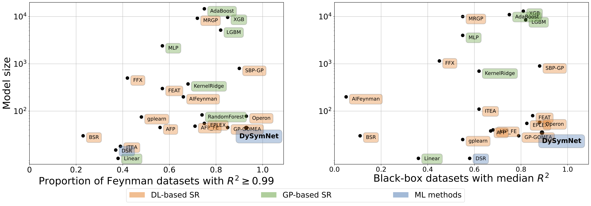
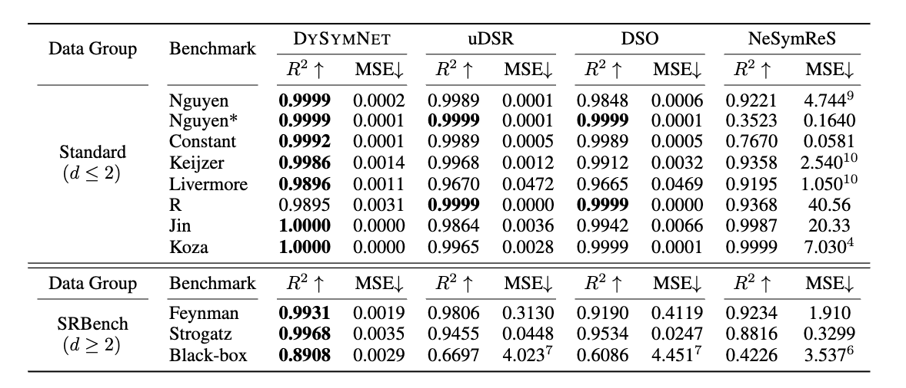

## A Neural-Guided Dynamic Symbolic Network for Exploring Mathematical Expressions from Data


This repository is the official implementation of [***A Neural-Guided Dynamic Symbolic Network for Exploring Mathematical Expressions from Data***](https://openreview.net/forum?id=pTmrk4XPFx) submitted to NeurIPS'23.

## Highlights

- Our proposed ***<span style="font-variant: small-caps;">DySymNet</span>*** is a new search paradigm for symbolic regression (SR) that searches the symbolic network with various architectures instead of searching expressions in the large functional space.
- ***<span style="font-variant: small-caps;">DySymNet</span>*** possesses promising capabilities in solving high-dimensional problems and optimizing coefficients, which are lacking in current SR methods.
- Extensive numerical experiments demonstrated that ***<span style="font-variant: small-caps;">DySymNet</span>*** outperforms state-of-the-art baselines across various SR standard benchmark datasets and the well-known SRBench with more variables.

## Requirements

Install the conda environment and packages:

```setup
conda env create -f environment.yml
conda activate dysymnet
```

The packages have been tested on Linux.

## Getting started

To train the model(s) in the paper, run this command:

```train

```

>📋  Describe how to train the models, with example commands on how to train the models in your paper, including the full training procedure and appropriate hyperparameters.

## Evaluation

To evaluate my model on ImageNet, run:

```eval
python eval.py --model-file mymodel.pth --benchmark imagenet
```

>📋  Describe how to evaluate the trained models on benchmarks reported in the paper, give commands that produce the results (section below).

## Pre-trained Models

You can download pretrained models here:

- [My awesome model](https://drive.google.com/mymodel.pth) trained on ImageNet using parameters x,y,z. 

>📋  Give a link to where/how the pretrained models can be downloaded and how they were trained (if applicable).  Alternatively you can have an additional column in your results table with a link to the models.

## Results

Our approach achieves the state-of-the-art  performance on **Standard benchmarks** and **SRBench benchmark**.

### Pareto plot on SRBench benchmark

**Our proposed *<span style="font-variant: small-caps;">DySymNet</span>* outperforms previous DL-based and GP-based SR methods in terms of fitting accuracy while maintaining a relatively small symbolic model size.** Pareto plot comparing the average test performance and model size of our method with baselines provided by the SRBench benchmark, both on *Feynman* dataset (left) and *Black-box* dataset (right).



### Fitting accuracy comparison



**See the [paper](https://openreview.net/forum?id=pTmrk4XPFx) for more experimental results.**


## Contributing

>📋  Pick a licence and describe how to contribute to your code repository. 
