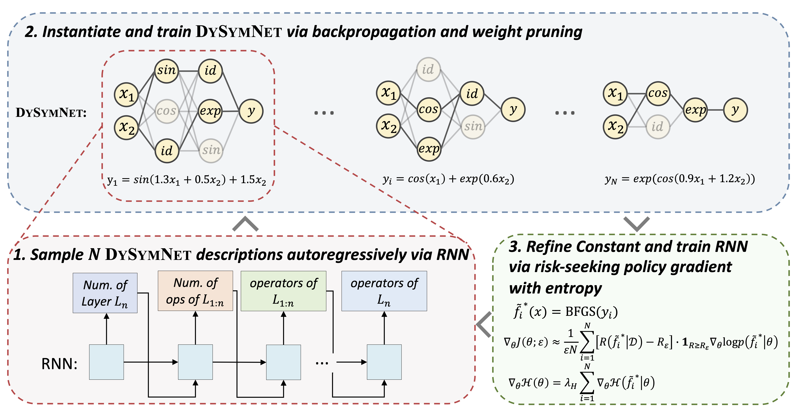

## DySymNet

<div align="center">
  
</div>



This repository contains the official Pytorch implementation for the paper [***A Neural-Guided Dynamic Symbolic Network for Exploring Mathematical Expressions from Data***](https://openreview.net/forum?id=pTmrk4XPFx) accepted by ICML'24.

[](https://openreview.net/pdf?id=IejxxE9DO2)
[](https://arxiv.org/abs/2309.13705)


## 🔥 Highlights

- ***<span style="font-variant: small-caps;">DySymNet</span>*** is a new search paradigm for symbolic regression (SR) that searches the symbolic network with various architectures instead of searching expressions in the large functional space.
- ***<span style="font-variant: small-caps;">DySymNet</span>*** possesses promising capabilities in solving high-dimensional problems and optimizing coefficients, which are lacking in current SR methods.
- ***<span style="font-variant: small-caps;">DySymNet</span>*** outperforms state-of-the-art baselines across various SR standard benchmark datasets and the well-known SRBench with more variables.

## 📦 Requirements

Install the conda environment and packages:

```setup
conda env create -f environment.yml
conda activate dysymnet
```

The packages have been tested on Linux.

## 📋 Getting started

The main running script is `SymbolicRegression.py` and it relies on configuring runs via `params.py`. The `params.py` includes various hyperparameters of the controller RNN and the symbolic network. You can configure the following hyperparameters as required:

#### parameters for symbolic network structure

|    Parameters    |                         Description                          | **Example Values** |
| :--------------: | :----------------------------------------------------------: | :----------------: |
|  `funcs_avail`   |                       Operator library                       |  See `params.py`   |
|    `n_layers`    |               Range of symbolic network layers               |    [2, 3, 4, 5]    |
| `num_func_layer` | Range of the number of neurons per layer of a symbolic network |  [2, 3, 4, 5, 6]   |

Note: You can add the additional operators in the `functions.py` by referring to existing operators and place them inside `funcs_avail`  if you want to use them.

#### parameters for controller RNN

|    Parameters    |                Description                | **Example Values** |
| :--------------: | :---------------------------------------: | :----------------: |
|   `num_epochs`   |            epochs for sampling            |        500         |
|   `batch_size`   |         Size for a batch sampling         |         10         |
|   `optimizer`    |        Optimizer for training RNN         |        Adam        |
|  `hidden_size`   |         Hidden dim. of RNN layer          |         32         |
| `embedding_size` |              Embedding dim.               |         16         |
| `learning_rate1` |      Learning rate for training RNN       |       0.0006       |
|  `risk_seeking`  | using risk seeking policy gradient or not |        True        |
|  `risk_factor`   |                Risk factor                |        0.5         |
| `entropy_weight` |              Entropy weight               |       0.005        |
|  `reward_type`   |      Loss type for computing reward       |        mse         |


#### parameters for symbolic network training

|     Parameters     |                  Description                  | **Example Values** |
| :----------------: | :-------------------------------------------: | :----------------: |
|  `learning_rate2`  |  Learning rate for training symbolic network  |        0.01        |
|    `reg_weight`    |             Regularizaiton weight             |        5e-3        |
|    `threshold`     |              Prunning threshold               |        0.05        |
|      `trials`      | Training trials for training symbolic network |         1          |
|    `n_epochs1`     |      Epochs for the first training stage      |       10001        |
|    `n_epochs2`     |     Epochs for the second training stage      |       10001        |
|   `summary_step`   |     Summary for every `n` training steps      |        1000        |
|    `clip_grad`     |    Using adaptive gradient clipping or not    |        True        |
|     `max_norm`     |     Norm threshold for gradient clipping      |        1.0         |
|   `window_size`    |  Window size for adaptive gradient clipping   |         50         |
| `refine_constants` |           Refining constants or not           |        True        |
|    `n_restarts`    |   Number of restarts for BFGS optimization    |         1          |
|     `add_bias`     |              adding bias or not               |       False        |
|     `verbose`      |         Print training process or not         |        True        |
|     `use_gpu`      |               Using cuda or not               |       False        |
|   `plot_reward`    |           Plot reward curve or not            |       False        |

**Note:** `threshold` controls the complexity of the final expression, and is a trade-off between complexity and precision, which you can customise according to your actual requirements.

#### parameters for genearting input data

|  Parameters   |                Description                 | **Example Values** |
| :-----------: | :----------------------------------------: | :----------------: |
|   `N_TRAIN`   |             Size of input data             |        100         |
|    `N_VAL`    |         Size of validation dataset         |        100         |
|    `NOISE`    | Standard deviation of noise for input data |         0          |
|   `DOMAIN`    |            Domain of input data            |      (-1, 1)       |
|   `N_TEST`    |            Size of test dataset            |        100         |
| `DOMAIN_TEST` |           Domain of test dataset           |      (-1, 1)       |

#### Additional parameters

`results_dir` configures the save path for all results

## 🤖 Symbolic Regression

We provide two ways to perform symbolic regression tasks.

#### Option1: Input ground truth expression

When you want to discover an expression for which the ground truth is known, for example to test a standard benchmark, you can edit the script `SymbolicRegression.py`  as follows:

```python
# SymbolicRegression.py
params = Params()  # configuration for a specific task
ground_truth_eq = "x_1 + x_2"  # variable names should be written as x_i, where i>=1.
eq_name = "x_1+x_2"
SR = SymbolicRegression(config=params, func=ground_truth_eq, fun_name=eq_name)  # A new folder named "func_name" will be created to store the result files.
eq, R2, error, relative_error = SR.solve_environment()  # return results
```

In this way, the function `generate_data` is used to automatically generate the corresponding data set $\mathcal{D}(X, y)$ for inference, instead of you generating the data yourself.

Then, you can run `SymbolicRegression.py` directly, or you can run it in the terminal as follows:

```python
python SymbolicRegression.py
```

After running this script, the results will be stored in path `./results/test/func_name`.

#### Option2: Load the data file

When you only have observed data and do not know the ground truth, you can perform symbolic regression by entering the path to the csv data file:

```python
# SymbolicRegression.py
params = Params()  # configuration for a specific task
data_path = './data/Nguyen-1.csv'  # data file should be in csv format
SR = SymbolicRegression(config=params, func_name='Nguyen-1', data_path=data_path)  # you can rename the func_name as any other you want.
eq, R2, error, relative_error = SR.solve_environment()  # return results
```

**Note:** the data file should contains ($X\_{dim} + 1$) colums, which $X\_{dim}$ is the number of independent variables and the last colum is the corresponding $y$ values.

Then, you can run `SymbolicRegression.py` directly, or you can run it in the terminal as follows:

```python
python SymbolicRegression.py
```

After running this script, the results will be stored in path `./results/test/func_name`.

#### Output

Once the script stops early or finishes running, you will get the following output:

```
Expression: x_1 + x_2
R2: 1.0
error: 4.3591795754679974e-13
relative_error:  2.036015757767018e-06
log(1 + MSE):  4.3587355946774144e-13
```

## 🔗 Citing this work

If you find our work and this codebase helpful, please consider starring this repo 🌟 and cite:

```bibtex
@inproceedings{
li2024a,
title={A Neural-Guided Dynamic Symbolic Network for Exploring Mathematical Expressions from Data},
author={Wenqiang Li and Weijun Li and Lina Yu and Min Wu and Linjun Sun and Jingyi Liu and Yanjie Li and Shu Wei and Deng Yusong and Meilan Hao},
booktitle={Forty-first International Conference on Machine Learning},
year={2024},
url={https://openreview.net/forum?id=IejxxE9DO2}
}
```
